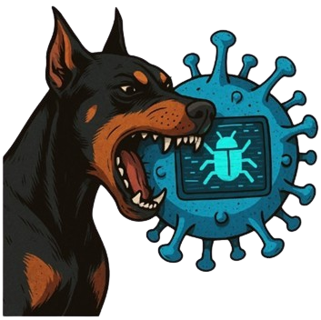

# WatchDog: Sistema de Resposta a Incidentes (Runbook CLI)

<div align="center">
  
</div>

## Descrição do Projeto

O **WatchDog** é uma ferramenta de linha de comando (CLI) desenvolvida em Python para auxiliar analistas de segurança em um Centro de Operações de Segurança (SOC) na resposta a incidentes. O projeto tem como objetivo principal demonstrar a criação e a execução de **runbooks** – guias passo a passo para mitigar ameaças cibernéticas.

A ferramenta é modular e extensível. Ela carrega dinamicamente runbooks que são scripts Python independentes, permitindo que a equipe de segurança crie e adicione novos guias de resposta de acordo com as ameaças que surgirem. Atualmente, o WatchDog inclui runbooks para as seguintes ameaças:

-   **Phishing:** Resposta a incidentes de e-mails maliciosos com anexos.
-   **Hacking:** Resposta a atividades de pós-exploração, como o uso de ferramentas de hacking em um endpoint.

Ao final da execução de cada runbook, a ferramenta oferece a opção de gerar um relatório detalhado em formato PDF, consolidando as ações tomadas durante o processo de mitigação.

## Funcionalidades

-   **Menu Interativo:** Interface de linha de comando intuitiva para navegação.
-   **Runbooks Modulares:** Capacidade de adicionar novos runbooks facilmente.
-   **Guias Passo a Passo:** Conduz o analista de segurança por cada etapa da resposta a um incidente.
-   **Geração de Relatórios:** Criação de um relatório em PDF com o registro das ações e o resultado da execução.
-   **Foco em Processo:** O projeto prioriza a lógica de um fluxo de trabalho de resposta a incidentes, sem a necessidade de infraestrutura complexa ou bancos de dados.

## Instalação e Uso

### Pré-requisitos

Certifique-se de ter o Python 3.6 ou superior instalado em seu sistema.

### Instalação

1.  **Clone o repositório:**
    ```bash
    git clone https://github.com/mthzo/watchdog.git
    cd watchdog
    ```
2.  **Instale as dependências:**
    O projeto utiliza a biblioteca `fpdf2` para a geração de relatórios em PDF. Instale-a usando o `pip`:
    ```bash
    pip install fpdf2
    ```

### Configuração do Ambiente Virtual

É **altamente recomendado** usar um ambiente virtual para gerenciar as dependências do projeto. Isso evita conflitos com outras bibliotecas instaladas em seu sistema.

1.  **Crie o ambiente virtual** na pasta raiz do projeto:
    ```bash
    python -m venv .venv
    ```

2.  **Ative o ambiente virtual:**
    * **No Windows (PowerShell):**
        ```bash
        .venv\Scripts\activate
        ```
    * **No macOS e Linux:**
        ```bash
        source .venv/bin/activate
        ```

    > **Nota para usuários Windows:** Se a ativação falhar com um erro de política de execução (`UnauthorizedAccess`), você precisará ajustar a política apenas para o seu usuário. Abra o PowerShell **como administrador** e execute o seguinte comando:
    >
    > ```bash
    > Set-ExecutionPolicy -ExecutionPolicy RemoteSigned -Scope CurrentUser
    > ```
    >
    > Após isso, feche o PowerShell e tente o comando de ativação novamente em uma nova janela.

### Instalação de Dependências

Com o ambiente virtual ativo, instale a biblioteca `fpdf2` para a geração de relatórios em PDF.
```bash
pip install fpdf2
```

### Como Executar

1. Execute o script principal diretamente do terminal (com o ambiente virtual ativo):

```bash
python watchdog.py
```

2. Siga as instruções do menu para selecionar e executar um dos runbooks disponíveis.

## Contribuição

Sinta-se à vontade para contribuir com este projeto, seja adicionando novos runbooks, aprimorando a interface ou corrigindo bugs.

**Faça um fork do projeto.**

Crie uma nova branch para a sua feature (git checkout -b feature/minha-nova-feature).

Faça o commit das suas alterações (git commit -m 'feat: adicionando nova funcionalidade').

Envie suas alterações (git push origin feature/minha-nova-feature).

**Abra um Pull Request.**